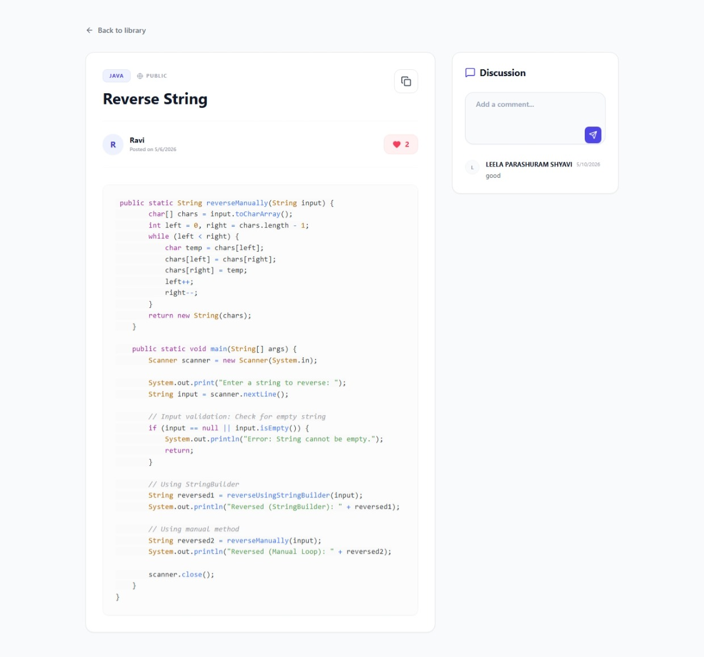

# DevSnippet

DevSnippet is a full-stack web application designed for developers to manage, store, and share code snippets. It provides a clean interface to organize code by programming language and tags, and includes features for both private and public snippet visibility.

## Features

- **Code Management**: Create, read, update, and delete code snippets.
- **Categorization**: Tag snippets and categorize them by programming language.
- **Visibility Settings**: Mark snippets as public for others to see, or keep them private.
- **Search & Filtering**: Search snippets by title and filter by language or tags.
- **Secure Authentication**: JWT-based authentication system.

## Tech Stack

- **Frontend**: React 18, Vite, Tailwind CSS, Framer Motion
- **Backend**: Java 17, Spring Boot 3.2, Spring Security, Spring Data JPA
- **Database**: MySQL 8.0+

## Getting Started

### Prerequisites

- Java JDK 17
- Node.js (v16+)
- npm
- MySQL (v8.0+)
- Maven

### Database Configuration

1. Log in to your local MySQL server.
2. Create the database and run the provided schema:
   ```bash
   mysql -u root -p < database/schema.sql
   ```
3. The schema includes default test users:
   - `john@example.com` (password: `password`)
   - `jane@example.com` (password: `password`)

### Backend Setup

1. Navigate to the backend directory:
   ```bash
   cd backend
   ```
2. Verify your database credentials in `src/main/resources/application.properties`:
   ```properties
   spring.datasource.url=jdbc:mysql://localhost:3306/devsnippet_db
   spring.datasource.username=root
   spring.datasource.password=your_mysql_password
   ```
3. Build and run the Spring Boot application:
   ```bash
   mvn clean install
   mvn spring-boot:run
   ```
   The backend server will start on `http://localhost:8080/api`.

### Frontend Setup

1. Open a new terminal and navigate to the frontend directory:
   ```bash
   cd frontend
   ```
2. Install dependencies:
   ```bash
   npm install
   ```
3. Start the development server:
   ```bash
   npm run dev
   ```
   The frontend application will be available at `http://localhost:3000` (or `http://localhost:5173` depending on Vite's port allocation).

## License

This project is licensed under the MIT License.

<p align="center">
  
</p>